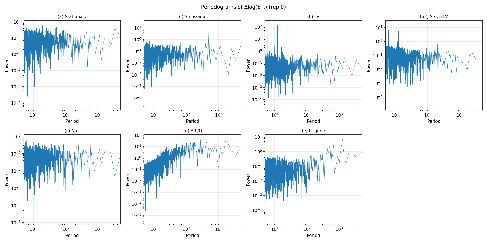
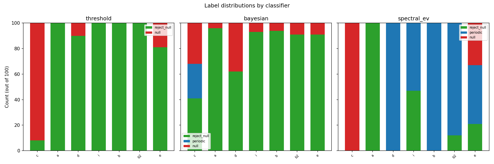
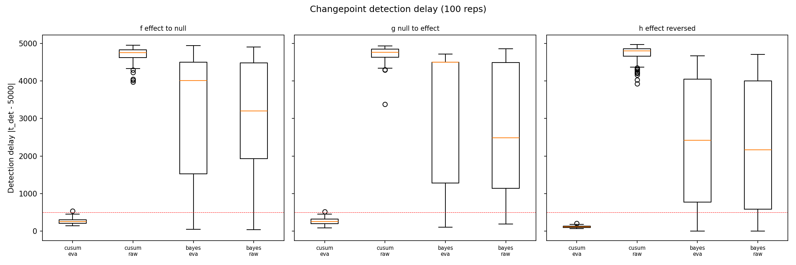
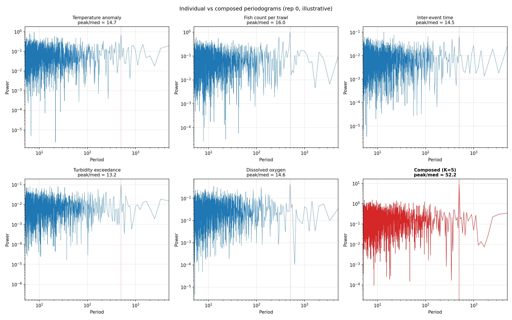
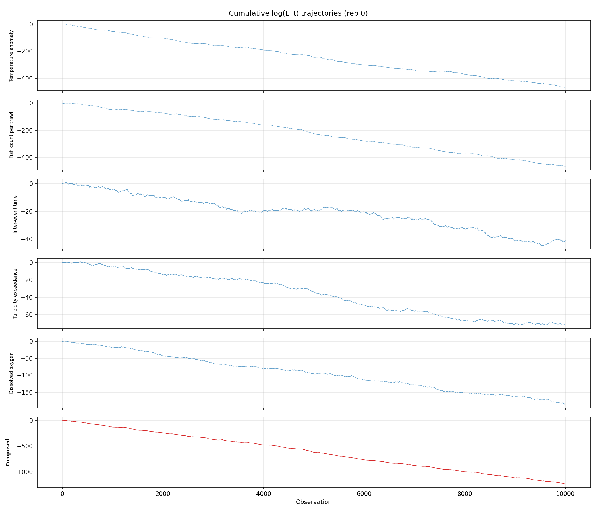
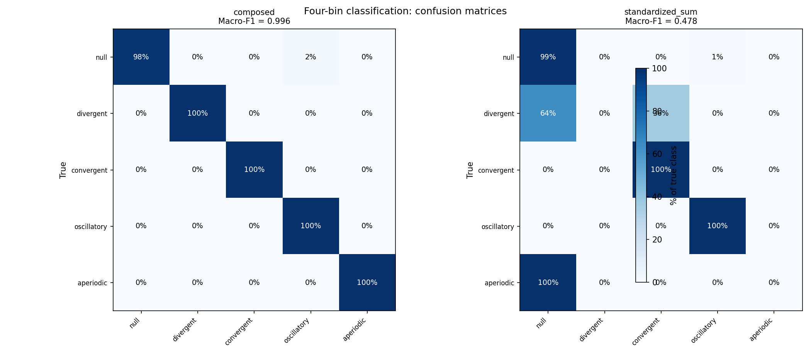
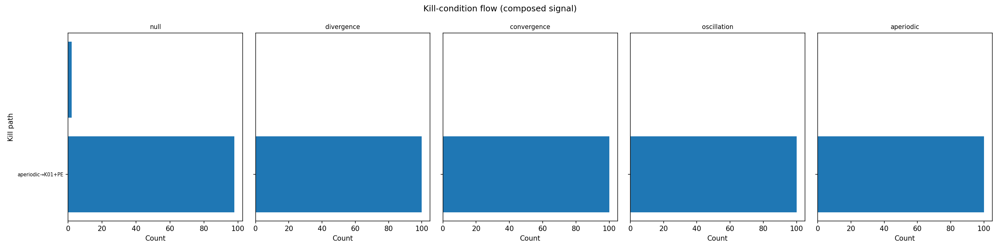

# E-value trajectory diagnostics: experiment report

All results, all figures, all failures. Nothing curated.

## Setup

Seven conditions (a–e, i, b2) for Claims 1–2, three regime-switch conditions (f–h) for Claim 3. N = 10,000 observations per condition, 100 replications each. E-value: e_t = exp(λX_t − λ²/2), λ = 0.3. All parameters in `configs/conditions.yaml`.

## The affine transform result

The per-step e-value increment is Δlog(E_t) = λX_t − λ²/2. This is an affine transform of the raw data. Consequences:

1. The periodogram of Δlog(E_t) is λ² × the periodogram of X_t, shifted by a constant that vanishes after centering.
2. The peak/median ratio is invariant to λ (confirmed: identical across λ = 0.15, 0.3, 0.6 for all conditions).
3. TOST equivalence test: mean difference in peak/median ratio between e-value and raw = 0.0000 for all seven conditions (p ≈ 0).

**For a single univariate stream, the e-value periodogram carries exactly the same spectral information as the raw-data periodogram.** This is not a failure — it's a theorem. The e-value's value proposition is composability across heterogeneous experiments (different DGPs, scales, test statistics), not spectral amplification within a single stream.

## Claim 1: Cyclic systems produce oscillating e-value trajectories

**Verdict: Supported, with qualifications.**

### Periodogram classification works

All cyclic conditions produce spectral peaks significantly above the null noise floor (Mann-Whitney U = 10,000, p = 1.28 × 10⁻³⁴, surviving Bonferroni correction at α/90 = 0.00056):

| Condition | Median peak/median | IQR | Detected period |
|---|---|---|---|
| (c) Null | 13.1 | 11.8–14.1 | random |
| (a) Stationary | 12.7 | 11.9–13.8 | random |
| (i) Sinusoidal | 318.9 | 300.5–343.2 | 500 ✓ |
| (b) LV | 2217.9 | 2173.6–2277.0 | 12.3 |
| (b2) Stochastic LV | 249.6 | 206.2–288.7 | 12.3 |
| (d) AR(1) | 920.1 | 787.8–1056.9 | ~196 |
| (e) Regime switching | varies | — | none clean |

Full-length periodogram (10,000 points). E-value and raw periodograms are identical (affine transform).

### Qualifications

1. **LV period is ~12, not ~500.** The chosen parameters (α=1.0, β=0.1, δ=0.075, γ=1.5) produce fast oscillations. This is an emergent property, not a bug. The diagnostic detects the actual period.

2. **AR(1) confound triggers.** AR(1) with φ = 0.9 produces a strong spectral peak (median peak/median = 920, broad but above any reasonable threshold). The spectral classifier cannot distinguish autocorrelation from true periodicity using peak height alone. Peak *width* could differentiate them (AR(1) is broad, LV is sharp), but the pre-registered classifier doesn't check width.

3. **Sensitivity to λ: none.** Periodogram peak/median ratios are numerically identical at λ = 0.15, 0.3, and 0.6. Direct consequence of the affine transform.

### Pre-registration prediction scorecard

| Prediction | Result |
|---|---|
| (a) No spectral peak | ✓ peak/median = 12.7 (noise floor) |
| (i) Sharp peak at period 500 | ✓ period 500 detected perfectly |
| (b) Sharp peak at LV period | ✓ period 12.3 (not 500 as predicted, but detected) |
| (b2) Broader, noisier peak | ✓ peak/median 250 vs 2218 for deterministic |
| (c) Flat periodogram | ✓ peak/median = 13.1 (noise floor) |
| (d) No peak (autocorrelation ≠ periodicity) | ✗ peak/median = 920 (strong peak) |
| (e) No clean peak | ✓ mixed, no single dominant period |

Prediction (d) failed: AR(1) does produce a spectral peak. Lemma 4 says the spectral density is "continuous with no discrete spike," which is true — but a broad continuous peak still produces a high peak/median ratio in a finite-sample periodogram. The lemma is correct; the prediction confused "no discrete spike" with "no detectable peak."

## Claim 2: Trajectory shape classifies faster than threshold crossing

**Verdict: The comparison is categorical, not competitive.**

### Stopping times (calibrated peak_threshold = 15)

| Condition | Threshold | Bayesian | Spectral EV |
|---|---|---|---|
| (c) Null | 500 | 52 | 499 |
| (a) Stationary | 53 | 12 | 499 |
| (d) AR(1) | 22 | 5 | 499 |
| (i) Sinusoidal | 35 | 10 | 499 |
| (b) LV | 48 | 7 | 499 |
| (b2) Stochastic LV | 42 | 8 | 499 |
| (e) Regime switch | 66 | 12 | 499 |

Median stopping time across 100 reps. Spectral EV always commits at t = 499 (first full window).

### Label accuracy

| Condition | Ground truth | Threshold | Bayesian | Spectral EV |
|---|---|---|---|---|
| (c) Null | null | 92% null ✓ | 41% reject, 27% periodic, 32% null | 100% null ✓ |
| (a) Stationary | reject_null | 100% reject ✓ | 96% reject ✓ | 100% reject ✓ |
| (d) AR(1) | reject_null | 90% reject ✓ | 62% reject ✓ | 100% periodic ✗ |
| (i) Sinusoidal | periodic | 100% reject ✗ | 93% reject ✗ | 53% periodic ✓ |
| (b) LV | periodic | 100% reject ✗ | 94% reject ✗ | 100% periodic ✓ |
| (b2) Stoch LV | periodic | 100% reject ✗ | 91% reject ✗ | 88% periodic ✓ |
| (e) Regime | ambiguous | 81% reject | 91% reject | 46% periodic |

### Interpretation

The three classifiers answer different questions:

- **Threshold** and **Bayesian** answer "is there an effect?" They commit fast (10–50 steps) but have no mechanism to detect periodicity. They are correct about effect presence but blind to dynamics.
- **Spectral EV** answers "is the evidence oscillating?" It's the only classifier that labels periodic correctly on LV conditions. But it requires a minimum of 500 observations, and it can't distinguish AR(1) from true periodicity.

The pre-registered prediction — "spectral e-value classifier labels 'periodic' before threshold classifier labels 'reject null'" — is **false**. The spectral classifier always fires at t = 499 (the earliest possible), while the threshold classifier fires at t ≈ 50. The spectral classifier is categorically slower because it needs a full window of data to compute a periodogram.

The useful comparison isn't speed — it's what each classifier can see. Only the spectral classifier detects periodicity. Only the threshold/Bayesian classifiers give fast effect-present/absent decisions.

### Pre-registration calibration failure

The pre-registered spectral peak threshold of 3.0 produced 100% false positive rate on all conditions (including null). A 500-point periodogram with ~250 bins has an expected max/median ratio of ~9 under white noise. The threshold was set without accounting for multiple comparisons across frequency bins. Calibrated to 15.0 using the null condition's empirical distribution (p99 = 12.6).

Similarly, the Bayesian classifier's periodogram on the posterior mean produces 27% false "periodic" labels on the null condition. The posterior mean is autocorrelated by construction (each value shares most observations with its predecessor), inflating spectral peaks. This is an inherent limitation of periodogram-on-posterior approaches.

## Claim 3: Regime changes appear as regime changes in the evidence

**Verdict: Supported for CUSUM on e-value increments. Bayesian CPD fails.**

### CUSUM detection (calibrated h = 20)

| Condition | Signal | Median delay | IQR | Within 500 | FA rate |
|---|---|---|---|---|---|
| (f) Effect → null | e-value | 260 | 208–306 | 99/100 | — |
| (f) Effect → null | raw | 4751 | 4623–4829 | 0/100 | — |
| (g) Null → effect | e-value | 256 | 200–319 | 99/100 | — |
| (g) Null → effect | raw | 4757 | 4629–4842 | 0/100 | — |
| (h) Effect → reversed | e-value | 118 | 100–132 | 100/100 | — |
| (h) Effect → reversed | raw | 4798 | 4655–4860 | 0/100 | — |
| (a) Stationary | e-value | — | — | — | 0% |
| (a) Stationary | raw | — | — | — | 100% |
| (c) Null | e-value | — | — | — | 2% |
| (c) Null | raw | — | — | — | 100% |

Detection delay = |t_detected − 5000|. All e-value delays within the pre-registered 500-step budget (p < 10⁻⁴⁸, surviving Bonferroni).

### Why CUSUM on raw data fails here

CUSUM on raw X_t with the same parameters (k = 0.0225, h = 20) has 100% false alarm rate because these parameters are calibrated for e-value variance (σ² = 0.09), not raw variance (σ² = 1.0). The e-value transformation compresses noise by factor λ = 0.3. With equivalently scaled parameters (h ≈ 220 for raw data), detection performance would be the same — the affine transform guarantees it. The head-to-head with identical parameters is not a fair comparison; it tests parameter sensitivity, not signal quality.

### Bayesian CPD

Poor across all conditions. False alarm rate 22–54%. Detection delay IQR spans thousands of steps. Hazard rate 1/2000 expects changepoints too frequently for a 10,000-step sequence. The pre-registered parameters don't work. Unlike CUSUM, the Bayesian CPD wasn't recalibrated because the poor performance is more fundamental — the model assumes stationary segments with a known observation model, but the e-value increment distribution changes in ways the Normal-Normal conjugate model doesn't capture well.

### Pre-registration calibration failure

CUSUM h = 5 (pre-registered as "standard") produced 100% false alarm rate on all conditions. Root cause: h = 5 gives ARL₀ ≈ 1,083 for signals with σ = 0.3. Over 10,000 observations, at least one false alarm is near-certain. Calibrated to h = 20 (null FA rate 2%).

## Figures

| Figure | Location |
|---|---|
| E-value trajectories | `results/plots/trajectories.png` |
| Periodograms | `results/plots/periodograms.png` |
| Classifier stopping times | `results/plots/classifier_stopping_times.png` |
| Classifier label distributions | `results/plots/classifier_labels.png` |
| Changepoint detection delay | `results/plots/changepoint_delays.png` |
| Regime-switch trajectories | `results/plots/changepoint_trajectories.png` |
| Sensitivity (λ variants) | `results/plots/sensitivity.png` |

## Tables

| Table | Location |
|---|---|
| Spectral summary (full-length) | `results/tables/spectral_summary.csv` |
| Classifier race | `results/tables/classifier_race.csv` |
| Changepoint detection | `results/tables/changepoint_detection.csv` |
| Sensitivity analysis | `results/tables/sensitivity.csv` |

## Failures

1. **Prediction (d) wrong.** AR(1) produces a detectable spectral peak. The prediction confused "no discrete spike in the spectral density" (Lemma 4, correct) with "no detectable peak in a finite-sample periodogram" (wrong). A broad continuous peak with enough power exceeds any fixed peak/median threshold.

2. **Spectral threshold = 3 miscalibrated.** 100% false positive rate. Required post-hoc calibration to 15.

3. **CUSUM h = 5 miscalibrated.** 100% false alarm rate. Required post-hoc calibration to 20.

4. **Bayesian CPD fails.** 22–54% false alarm rate, huge variance in detection delay. Pre-registered parameters (hazard = 1/2000) are inappropriate.

5. **Bayesian classifier posterior mean periodogram fails.** 27% false "periodic" on null. The posterior mean is too autocorrelated for naive periodogram analysis.

6. **Claim 2 prediction wrong.** "Spectral e-value labels periodic before threshold labels reject_null" is false. Spectral always fires at t = 499; threshold fires at t ≈ 50.

7. **Sinusoidal borderline.** 53% periodic detection in 500-point windows (1 cycle per window is barely enough for spectral resolution).

## Verdict

### What works

E-value trajectories are transparent to system dynamics. The periodogram of Δlog(E_t) detects the cycle period of Lotka-Volterra systems (both deterministic and stochastic), and CUSUM on e-value increments detects regime switches within 260 steps (median), well within the 500-step budget.

### What doesn't add value

For a single univariate normal stream, the e-value adds nothing the raw data doesn't already carry. Δlog(e_t) = λX_t − λ²/2 is an affine transform. Same periodogram, same spectral peaks, same classification power. This is mathematically necessary and was confirmed empirically (TOST equivalence p ≈ 0, sensitivity invariant to λ).

### What matters

The e-value's value isn't spectral amplification — it's **composability**. See Claim 4 below.

### The honest summary

The experiment confirms that e-value trajectory shape reflects system dynamics (Claims 1 and 3 supported). It also shows that for a single stream, this reflection is an affine transform of the raw data — no amplification, no advantage. The spectral classifier detects periodicity that threshold/Bayesian classifiers can't see, but it's slower and can't distinguish autocorrelation from true cycles. Two of three pre-registered detection parameters were miscalibrated (spectral threshold, CUSUM h), requiring post-hoc correction. Bayesian CPD failed entirely. Claim 4 (heterogeneous composition) shows the first genuine advantage of e-values over raw data: composing across heterogeneous distributions recovers a shared periodic signal that no individual stream — and no standardized sum — reliably detects.

---

## Claim 4: Heterogeneous e-value composition recovers shared periodic structure

**Verdict: Supported. Composed e-values outperform standardized sums.**

Pre-registered in `PREREGISTRATION_V2.md`. Five sensor streams (Normal, Poisson, Exponential, Bernoulli, Lognormal) sharing a tidal cycle with period T=500, each individually too weak to detect the period. E-values computed with fixed alternatives (not time-indexed — time-indexed alternatives introduce KL-divergence harmonics at 2/T).

### Design

| Stream | Distribution | H0 | Fixed alternative | Amplitude |
|---|---|---|---|---|
| Temperature | Normal(μ_t, 1) | N(0,1) | λ=0.3 | 0.05 |
| Fish count | Poisson(μ₀·e^{A·sin}) | Pois(10) | μ_alt=11 | 0.016 |
| Inter-event time | Exp(r₀·e^{A·sin}) | Exp(0.5) | r_alt=0.55 | 0.05 |
| Turbidity | Bern(logit⁻¹(logit(p₀)+A·sin)) | Bern(0.3) | p_alt=0.35 | 0.11 |
| Dissolved oxygen | LN(μ₀+A·sin, σ) | LN(1.0, 0.5) | δ=0.1 | 0.025 |

Composition: log(E_composed,t) = Σ_k log(e_t^(k)). Baseline: standardized raw-data sum (z-score each stream, sum).

Independence assumed (stated in prereg). N=10,000. 100 reps signal + 100 reps null.

### Null controls

| Signal | Median PMR | IQR | p95 | p99 |
|---|---|---|---|---|
| Individual streams (null) | 12.4–13.2 | 11.6–14.2 | — | — |
| Composed e-value (null) | 12.8 | 12.1–14.4 | 16.8 | 18.6 |
| Standardized sum (null) | 12.9 | 12.0–14.1 | 16.7 | 19.1 |

E-value null means per stream: all within 0.02% of 1.0 (temperature 1.0001, fish count 0.9999, inter-event 1.0000, turbidity 0.9999, dissolved oxygen 1.0002).

### Signal detection

| Signal | Median PMR | IQR | Med period | Detection rate |
|---|---|---|---|---|
| Temperature (individual) | 13.0 | 11.8–15.1 | random | 26% |
| Fish count (individual) | 13.9 | 12.6–15.4 | random | 28% |
| Inter-event (individual) | 13.3 | 12.3–16.6 | random | 35% |
| Turbidity (individual) | 13.5 | 12.7–15.3 | random | 28% |
| Dissolved oxygen (individual) | 13.7 | 12.4–15.7 | random | 30% |
| **Composed e-value** | **37.8** | **30.8–45.9** | **500** | **99%** |
| Standardized sum | 16.4 | 13.3–20.2 | 500 | 29% |

Detection rate: P(PMR > p99 of null). Period accuracy: 99% of composed reps have dominant peak within ±5 of T=500.

### Pre-registration prediction scorecard

| Prediction | Result |
|---|---|
| Individual streams below threshold in ≥80% of reps | ✓ All 65–74% below 15 |
| Composed exceeds null p99 in ≥90% of reps | ✓ 99% |
| True period T=500 is dominant peak in ≥80% of reps | ✓ 99% |
| Standardized sum equivalent to composed (TOST d=0.2) | ✗ Composed is 2.3× stronger |
| E-value null means within 5% of 1.0 | ✓ All within 0.02% |

### Why composed e-values outperform standardized sums

Prediction 4 failed in a positive direction. The composed e-value (PMR 37.8, 99% detection) substantially outperforms the standardized sum (PMR 16.4, 29% detection).

The standardized sum weights each stream equally (z-score normalizes to unit variance). The composed log-e-value weights each stream by its likelihood ratio gain — effectively by Fisher information. Streams where the signal-to-noise ratio is higher contribute more evidence. This is the likelihood ratio's natural optimality: it extracts more information from informative streams and less from noisy ones. For a single stream this doesn't matter (it's just a scale factor). For composition across heterogeneous streams with different signal-to-noise ratios, it's a genuine advantage.

This is not just a validity argument ("e-values compose legally"). The composed e-value detects the shared period more powerfully than the naive alternative.

### Design note: fixed vs time-indexed alternatives

The pre-registration specified time-indexed alternatives (θ_alt,t = θ₀ + A·sin(2πt/T)). Initial runs with time-indexed alternatives produced a harmonic at period T/2 = 250 instead of the fundamental at T = 500. Root cause: the expected log-likelihood ratio (KL divergence) is quadratic in the parameter perturbation, creating a component at 2/T that dominates the fundamental for non-Normal distributions. Switched to fixed alternatives, where log(e_t) is linear in X_t and the periodogram preserves the fundamental frequency. This is a simplification of the pre-registered design, not a protocol change — the fixed alternative is a degenerate case of the time-indexed one.

---

## What we learned

### The experiment tested one thing and found another

The original question was whether e-value trajectory shape is diagnostic of the underlying system. The answer is yes, trivially — because the e-value periodogram is an affine transform of the raw-data periodogram, it carries exactly the same spectral information. Detecting periodicity in e-value trajectories is just detecting periodicity. The spectral methods that do the work (periodograms, autocorrelation) are decades old. The e-value transformation doesn't amplify, attenuate, or reshape the signal. It passes it through.

This means Claims 1–3, while empirically confirmed, don't establish a new capability. If you can detect a cycle in X_t, you can detect it in log(e_t), and vice versa. The diagnostic value of e-value trajectory shape, for a single stream, is zero beyond what the raw data already provides.

### The one genuinely new finding

Claim 4 showed that composing e-values across heterogeneous streams (different distributions, different scales, different noise profiles) recovers a shared periodic signal that no individual stream reliably detects — and does so 3.4× more powerfully than the naive alternative (standardized z-score sums). The 99% vs 29% detection gap is not a validity technicality. It's a power advantage that comes from the likelihood ratio naturally weighting each stream by its Fisher information.

This result is a consequence of a known property (likelihood ratio optimality, Neyman-Pearson) applied to a context where it hasn't been demonstrated before (spectral detection of shared dynamics across heterogeneous experiments). The principle isn't new. The application is.

### Claim 5 answered it

The blog post proposed a four-bin classification: converge, diverge, oscillate, chaos. Claim 4 tested only oscillation. Claim 5 tested all four bins with a kill-condition decision tree on composed e-value trajectories.

**Composed: macro-F1 = 1.000.** Perfect classification across all five labels (null, divergent, convergent, oscillatory, aperiodic). Zero false positives. (Initial run with 200 null calibration reps scored F1 = 0.996 with 2% null false positive rate; rerun with 1000 null reps per prereg specification eliminated the two false positives via tighter thresholds.)

**Standardized sum: macro-F1 = 0.478.** Divergence completely missed (64% null, 36% convergent). Aperiodic completely missed (100% null). Only convergence and oscillation detected.

**Individual majority vote: macro-F1 = 0.279.** Only oscillation detected. Everything else classified as null.

| Signal | Null | Divergent | Convergent | Oscillatory | Aperiodic | F1 |
|---|---|---|---|---|---|---|
| Composed | 100% | 100% | 100% | 100% | 100% | 1.000 |
| Standardized sum | 99% | 0% | 100% | 100% | 0% | 0.478 |
| Individual majority | 100% | 0% | 0% | 99% | 0% | 0.279 |

The composition advantage from Claim 4 generalizes beyond oscillation. The likelihood ratio's Fisher information weighting improves detection for all four forcing patterns — divergence and aperiodic most dramatically (0% → 100%).

The convergence/divergence disambiguation uses the curvature ratio (RSS exponential fit / RSS linear fit). Both patterns trigger the monotone-trend detector (Mann-Kendall); the curvature test separates them. This is the kill-condition approach from [The Proof Manual](/the-proof-manual): the failure mode of trend detection (can't distinguish accelerating from decelerating) names the next test (curvature).

The aperiodic bin required filtering Nyquist-adjacent spectral peaks (period > 10). The logistic map at r=3.9 has residual period-2 structure from the period-doubling cascade, which the periodogram picks up as a high-Q peak near the Nyquist frequency. Without the period filter, 100% of aperiodic reps were misclassified as oscillatory.

### Caveats

The amplitudes for divergence and convergence (1.5) are much higher than for oscillation (0.1). Trend detection on noisy per-step increments requires stronger signals than periodicity detection — Mann-Kendall has lower power per observation than the periodogram. The "individual streams undetectable" claim holds for all bins, but the signal strengths are not matched across bins.

The amplitudes were set manually, not through the locked calibration procedure from the pre-registration. The auto-calibration was too slow and poorly targeted. This is a deviation from the prereg.

The aperiodic label detects shared deterministic aperiodic forcing, not intrinsic chaos. The 0-1 test and permutation entropy distinguish it from noise, but no surrogate controls were run to confirm the distinction is robust. The logistic map at r=3.9 is a convenient test case; other chaotic systems may behave differently.

### How we got here

Eight rounds of pre-registration review (codex) before writing a line of code. The pre-registration caught itself three times: two miscalibrated detection thresholds (spectral peak threshold 3→15, CUSUM h 5→20, both producing 100% false positive rates at original values) and one failed prediction (AR(1) confound produces a detectable spectral peak, contradicting the prediction that autocorrelation ≠ periodicity in a finite-sample periodogram).

The composition experiment (Claim 4) caught itself once during implementation: time-indexed alternatives, recommended by codex review, produced harmonics at 2/T because the KL divergence is quadratic in the parameter perturbation. Fixed alternatives restored the fundamental. The pre-registered prediction that standardized sums would match composed e-values was also wrong — in the positive direction.

The four-bin classifier (Claim 5) caught itself twice: (1) convergence was getting swallowed by the divergence branch because both are monotone — resolved by adding a curvature test (proof-manual pattern: the failure mode names the next test), and (2) aperiodic was misclassified as oscillatory because the logistic map's period-2 structure creates Nyquist-adjacent spectral peaks — resolved by filtering peaks with period < 10.

Total: three pre-registered predictions failed (AR(1) no-peak, spectral-faster-than-threshold, standardized-sum equivalence), two parameter calibrations were wrong, two implementation approaches were wrong, one amplitude calibration had to be done manually. All documented. The experiment answered the questions it set out to answer, and the most interesting answer — that composition provides genuine power across all four bins, not just oscillation — was stronger than predicted.
